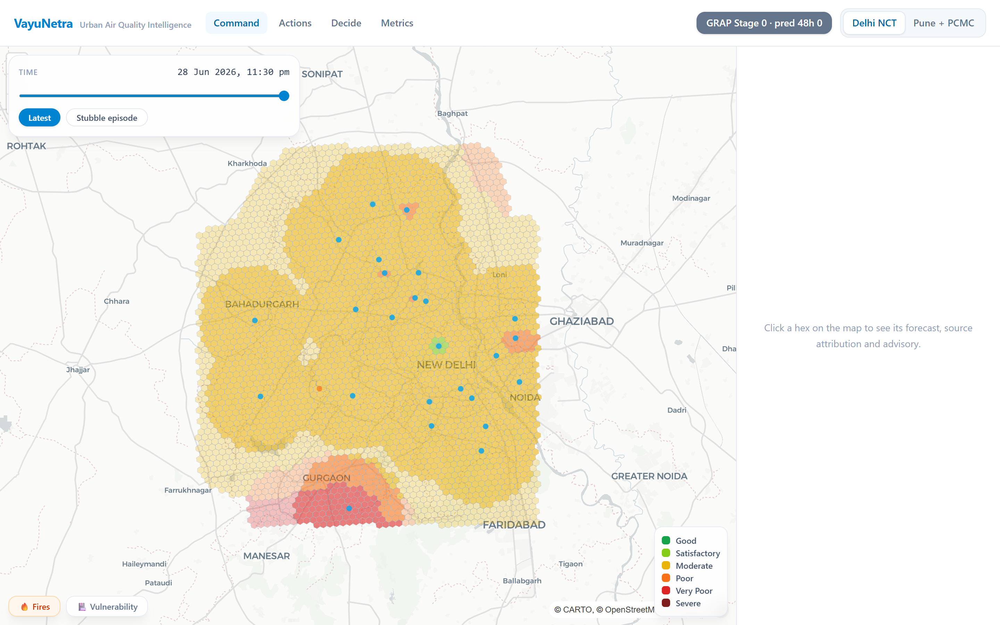
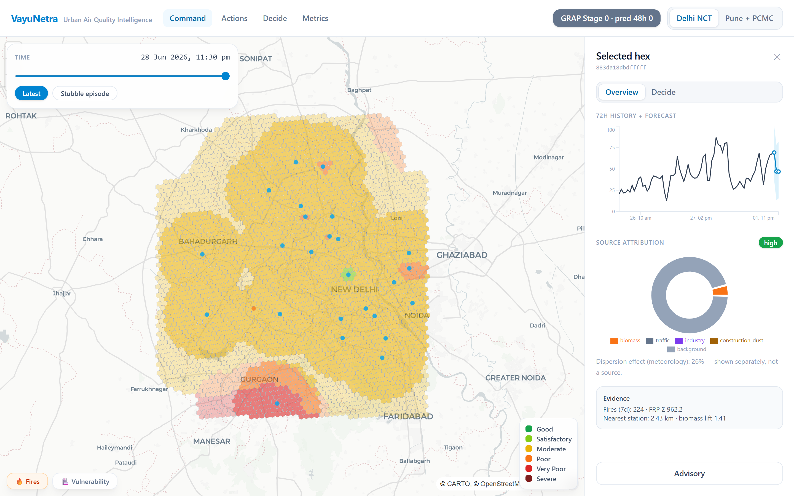
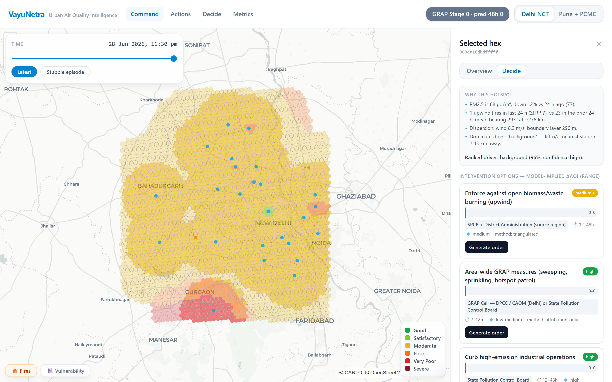
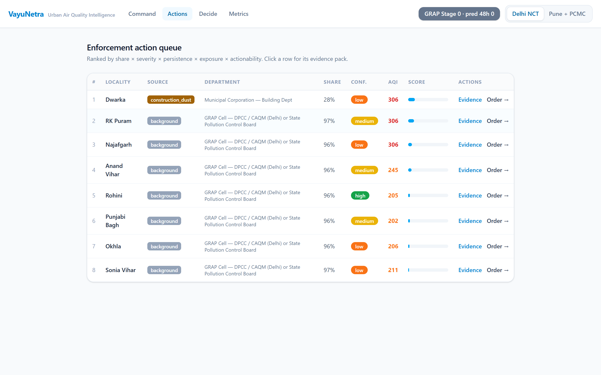
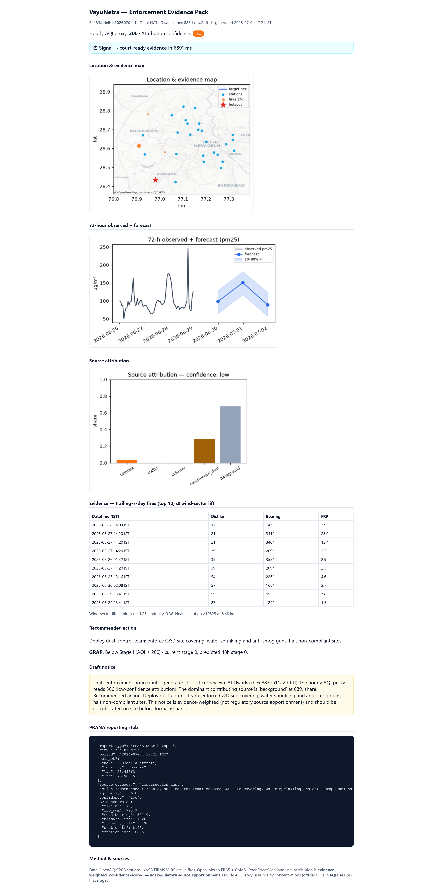
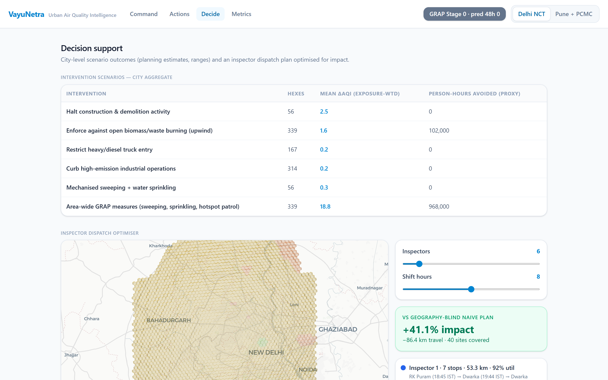
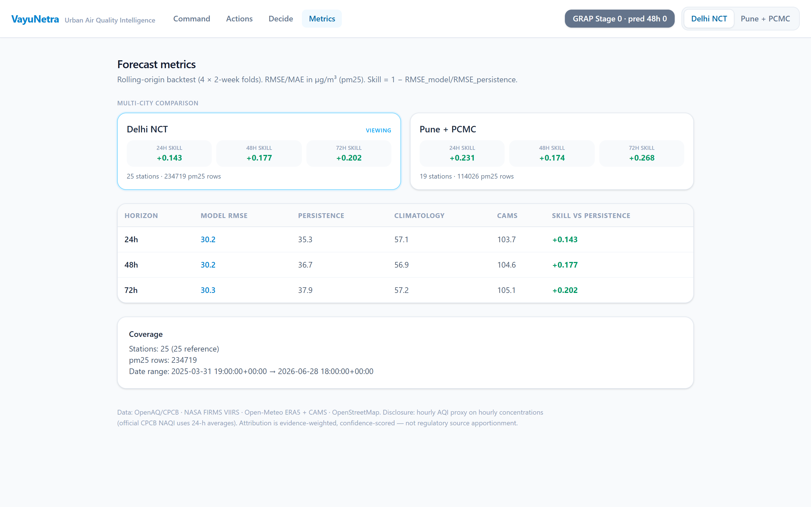
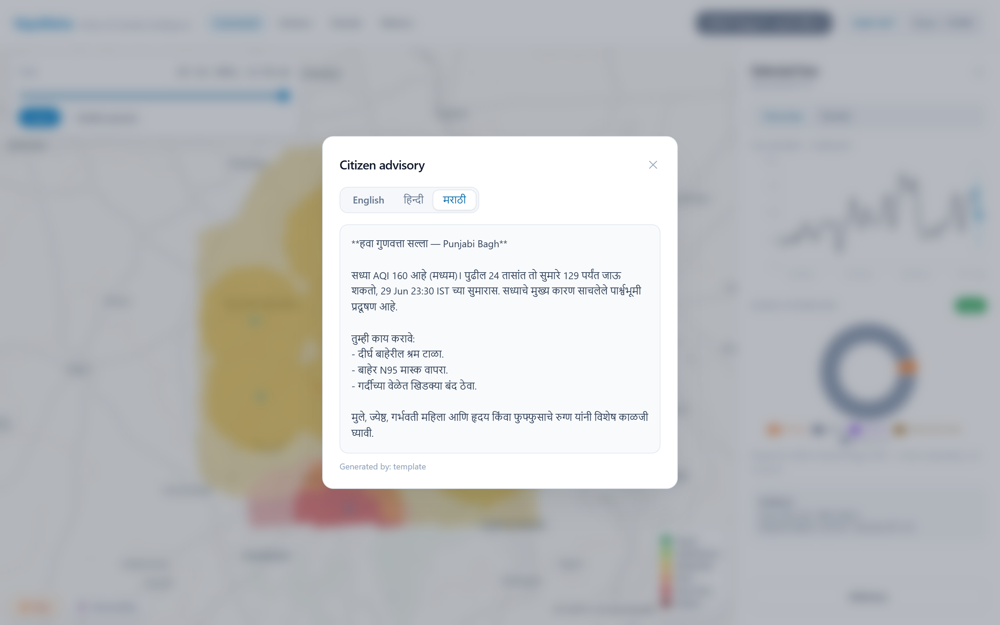
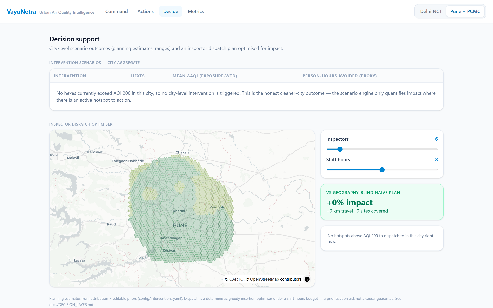

<div align="center">

# 🛰️ VayuNetra
### AI-Powered Urban Air Quality Intelligence for Smart-City Intervention

**Signal → source attribution → forecast → prioritised enforcement → court-ready evidence → citizen advisory.**
Built for the **ET AI Hackathon 2.0 · PS 5**. Two live cities (Delhi NCT + Pune/PCMC), 100% real public data, zero fabricated numbers.


</div>

> **The data exists. The intelligence layer to act on it does not.**
> India runs 900+ CAAQMS monitors under NCAP, yet a 2024 CAG audit found only **31%** of cities with monitoring data had any actionable response protocol. VayuNetra *is* that missing intelligence layer — the closed loop from a monitoring signal to a prioritised, evidence-backed intervention.



---

## ✨ What it does

Every hour, for each **~1 km² H3 hex**, VayuNetra fuses **five data families** — CPCB stations, NASA fire satellites, ERA5/CAMS weather, OSM land-use, and mobility proxy — then runs the full decision loop:

| Capability | What it answers | PS module |
|---|---|---|
| 🎯 **Source attribution** | *Which sources are responsible here, right now?* | Core #1 |
| 📈 **Hyperlocal forecasting** | *What will AQI be in 24–72 h at ward level?* | Core #2 |
| 🚔 **Enforcement intelligence** | *Where do I send inspectors for maximum impact?* | Core #3 |
| 🧭 **Decision support** | *What to do, who does it, how much it helps, at what confidence & cost?* | Decision Layer |
| 🗣️ **Citizen advisory** | *What should residents do — in their language?* | Module #5 |

---

## 🖥️ Feature showcase

### 1 · Command Center — live hyperlocal AQI
MapLibre + deck.gl **H3 hexagon layer** coloured by CPCB National AQI, with station dots, a fire-detection layer, a vulnerability layer (schools/hospitals), a **time scrubber** with replay presets (e.g. *Stubble episode*), and a Delhi⇄Pune toggle. GRAP stage (current + 48 h predicted) in the header.


### 2 · Source Attribution + Forecast (click any hex)
A **72-hour observed + forecast** chart with a 10–90% prediction-interval band, and a **source-attribution donut** across 5 sources with an inherited **confidence badge** and the meteorology "dispersion effect" shown separately. Evidence mini-list: fires, FRP, nearest-station distance, wind-sector lift.



### 3 · Decision Layer — scenario engine (the "Decide" tab)
A deterministic **why-engine** (PM trend, upwind-fire trend, dispersion status, ranked driver) plus **intervention options**, each with a **model-implied ΔAQI range `[lo, mid, hi]`**, method label (*triangulated* vs *attribution-only*), department, legal basis, time-to-impact, and a one-click **Generate order**. Confidence is a **tier word, never an invented percentage**.



### 4 · Enforcement Action Queue
Ranked by `share × severity × persistence × exposure × actionability`, **de-duplicated to distinct hotspot areas**, each mapped to its **responsible department & legal basis**, with **Evidence** and **Order** actions.



### 5 · Court-ready Evidence Pack (generated in seconds)
One click emits a **self-contained document**: location/evidence map, 72-h forecast + PI, attribution chart, trailing-7-day fire table with wind-sector lift, a draft enforcement notice, a **CPCB PRANA reporting stub**, and a method appendix — instrumented with a **"signal → evidence in _N_ ms"** stopwatch.



### 6 · Decision Support & Inspector Dispatch Optimiser
City-level scenario comparison (ΔAQI ranges + person-hours), and a **greedy insertion dispatch optimiser** routing N inspectors under a shift budget vs a geography-blind naive plan — headline: **+41% impact, −86 km** at 6 inspectors on the Delhi snapshot.



### 7 · Metrics — honest backtests vs baselines
Rolling-origin backtest with a **multi-city comparison strip** and RMSE vs persistence / climatology / CAMS per horizon, printed *inside the product*.



### 8 · Citizen Advisory — EN / हिन्दी / मराठी
Deterministic templates with **injected numbers (never LLM-generated)**; optional LLM polish. Marathi for the Pune demo, per the PS's own language-per-city logic.



### 9 · Honest cleaner-city behaviour (Pune)
Toggle to Pune and the system **reports "no action needed"** rather than inventing hotspots — because Pune genuinely doesn't exceed AQI 200 right now. Epistemic honesty over inflated claims.



---

## 📊 Results (measured on this build — nothing estimated)

**Forecast skill** (`1 − RMSE_model/RMSE_persistence`, PM2.5 µg/m³):

| City | 24 h | 48 h | 72 h | Coverage |
|---|---|---|---|---|
| **Delhi** | +0.143 | +0.177 | +0.202 | 25 CPCB stations · 234,719 PM2.5 rows · 54,450 fires |
| **Pune** | **+0.231** | +0.174 | +0.268 | 19 stations · 114,026 PM2.5 rows · 15,847 fires |

Model RMSE ≈ **30** (Delhi) / **22** (Pune) vs persistence 35–38 / 28–31, climatology ~57 / ~31, CAMS ~104 / ~22 — **beats every baseline at every horizon**.

- **Attribution validation:** on the 2025-11-11 stubble day, the model counterfactual (Method M) and attribution arithmetic (Method A) **agree 82.0%** across 2,863 high-biomass hexes.
- **Dispatch vs naive (Delhi):** +159% impact at 2 inspectors · +96% at 4 · +41% at 6 · −312 km at 10.
- **Latency:** evidence/order pack ~2–5 s warm (< 30 s target); scenario simulate ~20 ms.

> **Honest notes (kept in the story):** Pune 72 h — raw CAMS (21.8) edges the model (22.7). Delhi 24 h skill (0.143) is below the 0.25 target — documented in [`docs/DIAGNOSIS.md`](docs/DIAGNOSIS.md), not hidden.

---

## 🏗️ Architecture

```
SOURCES          INGEST          STORE (Parquet)    FEATURES         MODELS               ACT               SERVE
OpenAQ/CPCB  →  openaq.py   →   measurements ┐                                                             
NASA FIRMS   →  firms.py    →   fires        ├→ build.py      →  train → evaluate →  ranker + evidence  →  FastAPI  →  React
Open-Meteo   →  meteo.py    →   met, cams    │  interpolate   →  predict            simulate + dispatch   (backend/  (MapLibre
OSM/Overpass →  overpass.py →   grid,static  ┘  aqi.py        →  attribution        grap + advisory        app/)     +deck.gl)
```

**Offline-first (key design):** the UI never calls a third-party API — everything renders from local Parquet snapshots, so the demo can't break on stage. `LIVE_MODE=1` enables hourly APScheduler refresh. Full mermaid diagram: [`docs/architecture.md`](docs/architecture.md).

**The attribution innovation** — triangulated: (1) **TreeSHAP** temporal decomposition on the forecaster *(native LightGBM `pred_contrib` — exact SHAP, no `shap`/`numba` dependency)*, (2) **spatial ridge** on land-use covariates, (3) **wind-sector lift** as a directional cross-check → 5 source shares + a confidence badge, explicitly labelled *"evidence-weighted, not regulatory source apportionment."*

---

## 🚀 Quickstart

```bash
cp .env.example .env          # add 2 free keys: OPENAQ_API_KEY, FIRMS_MAP_KEY
make setup                    # uv sync + frontend npm install
make pipeline                 # geo → data → features → train → evaluate → predict → attribution → actions
make demo                     # API :8000 + UI :5173   → open http://localhost:5173
```

**Windows (no `make`):** `uv run python tasks.py setup | pipeline | api | ui | test | decide-smoke`.
Data is committed as snapshots-free (regenerated by the pipeline); the UI runs fully offline once built.

| Required key (both free) | Where |
|---|---|
| `OPENAQ_API_KEY` | https://explore.openaq.org/register |
| `FIRMS_MAP_KEY` | https://firms.modaps.eosdis.nasa.gov/api/map_key/ |

Open-Meteo and OpenStreetMap need no key. Optional: `DATA_GOV_IN_API_KEY`, `LLM_PROVIDER=nim|anthropic`.

---

## 🔌 Data sources, licences & rate limits

| Source | Role | Rate limit | Freshness | Licence |
|---|---|---|---|---|
| **OpenAQ v3** (mirrors CPCB) | station PM2.5/PM10/NO₂ | 60/min, no daily cap | `/latest` ≈ 1 h behind | CC BY 4.0 |
| **NASA FIRMS** VIIRS | active-fire (stubble) | 5,000 / 10 min | NRT ≈ 3 h | NASA open |
| **Open-Meteo** ERA5 + forecast + CAMS | meteorology + AQ baseline | 10,000/day | continuous | CC BY 4.0 |
| **OpenStreetMap** (Overpass) | industrial/roads/schools/hospitals | fair use | static | ODbL |
| **CARTO** | basemap tiles | fair use | — | © OSM © CARTO |

Hourly live refresh uses **<1%** of every limit; best achievable freshness ≈ 1 h (CPCB stations report hourly).

### Real-time mode
Set `LIVE_MODE=1` in `.env` and the API schedules an **hourly latest-only refresh** (APScheduler) — pulling recent readings via the OpenAQ `/hours` API + FIRMS NRT + Open-Meteo forecast, merging them into the snapshots and re-deriving features → forecast → attribution → actions. A **Refresh** button in the app header triggers it on demand (`POST /api/refresh`), and `GET /api/freshness/{city}` reports how old the data is. Offline-first still holds — the UI always serves the latest local snapshot.

---

## 🧪 Tech stack & quality

**Backend:** Python 3.11+ · FastAPI · Parquet + DuckDB · geopandas + H3 · LightGBM · matplotlib/fpdf2 · APScheduler · boto3
**Frontend:** Vite + React + TypeScript · MapLibre GL + deck.gl (H3HexagonLayer, PathLayer) · Recharts · Tailwind v4
**Quality:** 28 backend tests (exact AQI vectors, attribution invariants, API smoke) · `tsc --noEmit` + `vite build` clean · no fabricated data anywhere.

---

## 📁 Repository

```
config/         cities.yaml · aqi_breakpoints.yaml · grap.yaml · interventions.yaml
backend/
  ingest/       openaq · meteo · firms · overpass · datagov
  geo/          grid (H3) · static_features
  features/     aqi · build · interpolate
  models/       train · evaluate · predict · attribution · baselines · event_study
  actions/      ranker · evidence · grap · simulate · dispatch · why
  advisory/     generate · llm · templates/{en,hi,mr}
  app/          FastAPI (main · api · schemas · deps)
frontend/       React app (components, pages)
scripts/        run_pipeline · decide_smoke
docs/           architecture · metrics · DECISION_LAYER · DIAGNOSIS · PROJECT_DOSSIER · screenshots
```

## 📚 Documentation
- [`docs/PROJECT_DOSSIER.md`](docs/PROJECT_DOSSIER.md) — complete measured reference (for the deck/report)
- [`docs/architecture.md`](docs/architecture.md) — system diagram
- [`docs/metrics.md`](docs/metrics.md) — full backtest, latency, triangulation cross-check
- [`docs/DECISION_LAYER.md`](docs/DECISION_LAYER.md) — scenario-engine method note
- [`docs/DIAGNOSIS.md`](docs/DIAGNOSIS.md) — honest skill-shortfall analysis

## ⚖️ The honesty architecture
No fabricated data, ever · attribution = evidence-weighted estimation (not regulatory apportionment) · AQI is a disclosed hourly proxy · decision outputs are **ranges + inherited confidence tiers**, never invented percentages · all intervention priors are visible/editable in `config/interventions.yaml` · language is *"planning estimate"*, never *"will reduce"*.

---

<div align="center">
<sub>Data © OpenAQ/CPCB · NASA FIRMS · Open-Meteo/ECMWF · OpenStreetMap · CARTO. Prototype for research/education.</sub>
</div>
