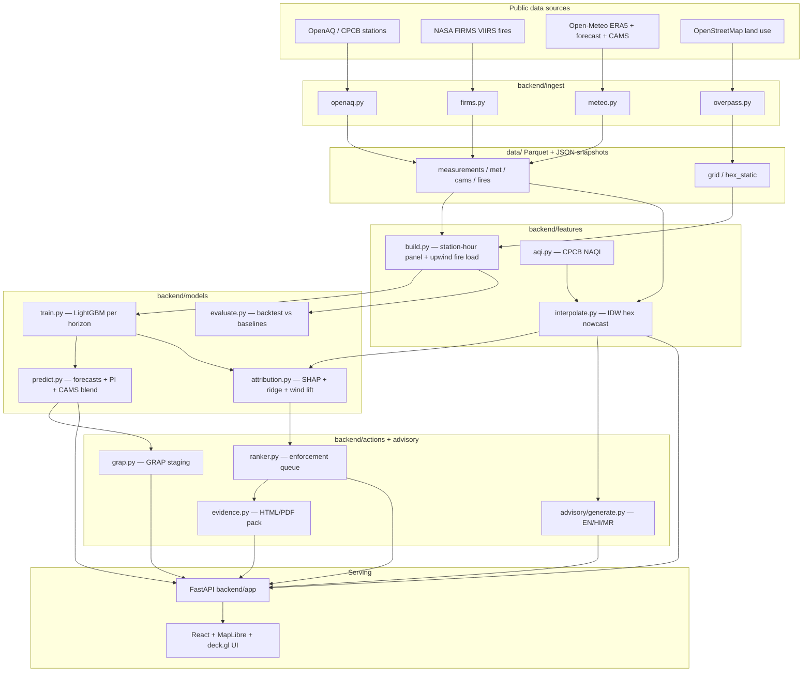

# VayuNetra — Architecture

VayuNetra turns existing public air-quality signals into **evidence-backed
enforcement actions**. Everything renders offline from local Parquet snapshots;
live third-party APIs only refresh those snapshots.

## Key design decisions
- **H3 res-8 hexes** replace ward shapefiles — the most fragile external dependency
  is eliminated; a new city is one YAML block.
- **Offline-first**: the UI never blocks on a live API; `LIVE_MODE=1` refreshes
  snapshots hourly via APScheduler.
- **TreeSHAP via LightGBM `pred_contrib`** — exact SHAP values without the
  `shap`/`numba`/`llvmlite` dependency chain (which does not build on Python 3.12).
- **Triangulated attribution** (temporal SHAP + spatial ridge + wind-sector lift)
  with an explicit confidence badge — labelled *evidence-weighted, not regulatory
  source apportionment*.
- **Honest evaluation**: rolling-origin backtest vs persistence / climatology / CAMS;
  results (including shortfalls) are printed, never hidden.
